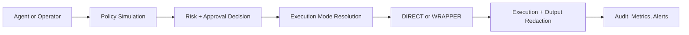

<p align="center">
  
</p>

<h1 align="center">Niyam</h1>

<p align="center">
  Command control for developer agents, operators, and high-trust teams.
</p>

<p align="center">
  Self-hosted. Approval-aware. Audit-heavy. Wrapper-capable.
</p>

## What Niyam Is

Niyam is the control layer between:

- an agent that wants to run a command
- the machine that would have executed it blindly

It lets you decide three things before execution happens:

1. how risky the command is
2. whether it needs approval
3. whether it runs `DIRECT` or inside a wrapper path

This is not a hosted approval SaaS. Niyam is a single-instance system you run in your own environment.

## Why It Exists

Most teams hit the same wall with automation:

- full shell access is too permissive
- blanket lock-down kills velocity
- logs alone do not explain intent, approval, or execution context

Niyam solves that with one operating model:

- low-risk commands can move immediately
- risky commands can stop for review
- especially sensitive commands can be forced through a container, jail, or wrapper
- every decision is stored, observable, and exportable

## The Product Loop



## What You Get

- Server-truth policy simulation before submission
- Rule-driven approvals for `LOW`, `MEDIUM`, and `HIGH` workflows
- Rule-driven `DIRECT` vs `WRAPPER` execution
- Built-in rule packs for `git`, `gh`, `docker`, `kubectl`, and `terraform`
- Prebuilt policy templates for common developer tooling so you can start from sane defaults instead of writing regexes from scratch
- Two-person approval support for higher-risk commands
- Storage-time secret redaction plus encrypted raw execution payloads
- Persistent admin sessions and bearer-token agent access
- Structured logs, metrics, alerts, audit history, and export paths
- Backup, restore, exec-key rotation, load, soak, and smoke tooling

## Upcoming Channels

Niyam is built as a self-hosted control layer first, and the next operator-facing channel work is aimed at bringing approvals closer to where teams already collaborate.

Planned approval channels:

- Slack approval prompts for pending commands
- Discord approval prompts for pending commands
- Chat-driven approve or reject actions with rationale capture
- Channel notifications for high-risk and wrapper-routed operations

The intent is straightforward: let an operator approve a risky command from a trusted chat surface while Niyam remains the system of record for policy, execution, and audit.

## Quick Start

```bash
npm install
NIYAM_ADMIN_PASSWORD=change-me NIYAM_EXEC_DATA_KEY=local-dev-key npm start
```

Open `http://localhost:3000` and sign in with:

- username: `admin` unless `NIYAM_ADMIN_USERNAME` is set
- password: the value of `NIYAM_ADMIN_PASSWORD`

If you want an interactive bootstrap instead of setting everything by hand:

```bash
./oneclick-setup.sh
```

or:

```bash
npm run setup:interactive
```

The same script now has a top-level `Start existing server env and stream logs` option if you already have `.env.local` or another env file and just want to boot Niyam fast.

## What It Looks Like In Practice

- `ls public` can resolve to `LOW` and run immediately
- `git merge` can require approval but still stay `DIRECT`
- `gh workflow run` can require approval and resolve to `WRAPPER`
- destructive filesystem patterns can be blocked or isolated by rule

## Prebuilt Policy Templates

Niyam ships with curated policy templates for tooling teams already use every day:

- `gh`
- `terraform`
- `kubectl`
- `docker`
- `git`

These are not just labels in the UI. They are installable starting points for:

- risk classification
- approval defaults
- wrapper routing for sensitive operations
- faster operator setup with fewer hand-written rules

The goal is simple: install a pack, review the generated policy, and start from a usable baseline instead of building everything from zero.

## Read The Right Doc

### Start Here

- [Local setup](./docs/local_setup.md)
- [Usage guide](./docs/usage.md)
- [Feature guide](./docs/features.md)

### Operators

- [Configuration reference](./docs/configuration.md)
- [Self-hosted deployment](./docs/deployment.md)
- [Backup and restore](./docs/backup_restore.md)
- [Exec key rotation](./docs/key_rotation.md)
- [Load and soak testing](./docs/load_testing.md)

### Integrators And Reviewers

- [API reference](./docs/api_reference.md)
- [Security](./docs/security.md)
- [Contributing](./docs/contributing.md)
- [Public release checklist](./docs/public_release.md)
- [Test report](./docs/test_report.md)

## Verify A Release

```bash
npm test
npm run smoke
npm run smoke:wrapper
npm run smoke:dashboard
npm run smoke:dashboard:reset
npm run load
npm run soak
```

What that proves:

- policy simulation works against the real server
- rule-pack install and matching work end to end
- secret redaction reaches command history, output, and audit history
- wrapper routing works when a rule resolves to `WRAPPER`
- dashboard smoke can safely populate realistic demo activity for UI review
- dashboard smoke reset can remove only the demo commands, rules, approvals, and audit rows it created
- backup, restore, and exec-key rotation work on live data paths
- the API survives burst and sustained benchmark traffic

## Smoke Flows

- `npm run smoke`
  Validates the core runtime: boot, auth, metrics, submission, approval, execution, and stored history.
- `npm run smoke:wrapper`
  Validates the rule-driven `WRAPPER` path with a harmless local wrapper.
- `npm run smoke:dashboard`
  Populates the dashboard with safe demo activity so you can inspect stats, pending approvals, history, and audit UI with realistic data.
- `npm run smoke:dashboard:reset`
  Removes only the dashboard smoke artifacts by using the smoke state file and `dashboard_smoke` metadata tags.

## Operating Thesis

Niyam is for teams that want agents to be useful without becoming invisible root shells.

It gives you a narrow, explicit place to enforce approval, isolation, auditability, and recovery before command execution becomes an incident review.
