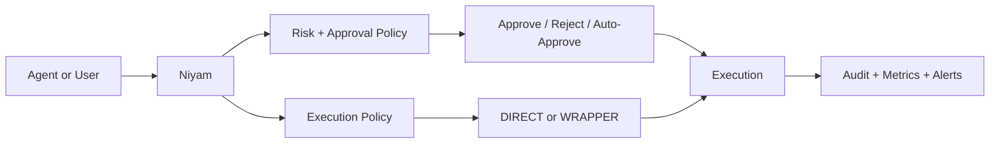

# Niyam

> Command control for developer agents and operators.

Niyam is a self-hosted command governance layer. It sits between "a tool wants to run a command" and "that command actually executes on a machine".

It is built for one job: let teams move fast with automation without giving raw shell access a free pass.

## What Niyam Solves

- Approval control: risky commands can require human sign-off before they run.
- Execution control: commands can run `DIRECT` or be forced into `WRAPPER` mode.
- Auditability: submissions, approvals, rejections, executions, failures, and kills are recorded.

This is not a SaaS product. Niyam is a single-instance, self-hosted service you run in your own environment.

## The Model



The important distinction is simple:

- approval policy decides whether a command may run
- execution policy decides how it must run

That lets you keep something like `git merge` as approved but `DIRECT`, while forcing more sensitive commands into a wrapper or containerized runtime.

## Why Developers Use It

- Agents stop being all-or-nothing shell access.
- High-friction approval is applied only where it matters.
- Isolation can be rule-driven instead of globally punitive.
- Operators get a durable trail of what happened and why.

## Quick Start

```bash
npm install
NIYAM_ADMIN_PASSWORD=change-me npm start
```

Open `http://localhost:3000` and sign in with:

- username: `admin` unless `NIYAM_ADMIN_USERNAME` is set
- password: the value of `NIYAM_ADMIN_PASSWORD`

## Developer Docs

- [Local setup](./docs/local_setup.md)
- [Usage guide](./docs/usage.md)
- [API reference](./docs/api_reference.md)
- [Configuration reference](./docs/configuration.md)
- [Self-hosted deployment](./docs/deployment.md)

## Runtime Highlights

- SQLite-backed persistence
- dashboard login with persistent sessions
- bearer-token auth for agents
- two-person approval support for higher-risk commands
- rule-driven `DIRECT` vs `WRAPPER`
- working-directory confinement
- structured logs, metrics, and alert hooks
- smoke tests for both normal and wrapper execution paths

## Smoke Tests

```bash
npm run smoke
npm run smoke:wrapper
```

Use `smoke:wrapper` to prove a matching rule sends execution through `WRAPPER` mode while the default remains `DIRECT`.

## Example Policy Shape

- `ls`, `cat`, `git status`: `LOW` + `DIRECT`
- `git merge`: approval required, still `DIRECT`
- `gh workflow run`: approval required, `WRAPPER`
- destructive filesystem patterns: `HIGH` + `WRAPPER`

## Current Gaps Worth Adding

- policy simulation before submission
- built-in rule packs for `git`, `gh`, `docker`, `kubectl`, `terraform`
- secret redaction in command output and audit history
- versioned migrations and wider automated test coverage
- multi-admin approval routing for larger teams
