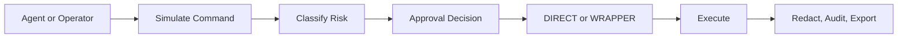

<p align="center">
  
</p>

<h1 align="center">Niyam</h1>

<p align="center">
  Approval-first command control for AI agents, operators, and high-trust engineering teams.
</p>

<p align="center">
  Self-hosted. Policy-aware. Wrapper-capable. Audit-heavy.
</p>

<p align="center">
  <a href="./docs/local_setup.md">Local Setup</a> ·
  <a href="./docs/usage.md">Usage</a> ·
  <a href="./docs/api_reference.md">API</a> ·
  <a href="./docs/deployment.md">Deployment</a>
</p>

## The Pitch

Agents are useful right up until they become invisible shells with too much reach.

Niyam is the control layer between:

- the system that wants to run a command
- the machine that would otherwise execute it blindly

It gives you one explicit place to decide:

- how risky a command is
- whether it needs approval
- whether it runs `DIRECT` or through a wrapper
- how it gets audited, redacted, and recovered

This is not a hosted approval SaaS. Niyam is a self-hosted, single-instance control layer you run inside your own environment.

## Why It’s Useful

- low-risk commands can move immediately
- risky commands can stop for approval
- sensitive commands can be forced into wrapper or containerized paths
- destructive patterns can be blocked entirely
- every request, approval, execution, rejection, and output trail is recorded

In practice:

- `ls public` can auto-run as `LOW`
- `git merge` can require approval and still stay `DIRECT`
- `gh workflow run` can require approval and resolve to `WRAPPER`
- high-risk operations can require multiple approvers

## How It Works



## Why People Adopt It

- safer agent autonomy without turning everything off
- faster operator review than ad hoc shell access
- cleaner auditability than “trust the logs”
- better defaults through built-in policy templates

## Built In

- policy simulation before submission
- approval workflows for `LOW`, `MEDIUM`, and `HIGH`
- rule-driven `DIRECT` vs `WRAPPER` execution
- built-in policy templates for `gh`, `git`, `docker`, `kubectl`, and `terraform`
- two-person approval support for high-risk operations
- storage-time secret redaction with encrypted raw execution payloads
- structured logs, metrics, alerts, backup, restore, and smoke tooling

## Quick Start

```bash
npm install
NIYAM_ADMIN_PASSWORD=change-me NIYAM_EXEC_DATA_KEY=local-dev-key npm start
```

Then open `http://localhost:3000` and sign in with:

- username: `admin`
- password: the value of `NIYAM_ADMIN_PASSWORD`

If you want guided setup instead:

```bash
./oneclick-setup.sh
```

or:

```bash
npm run setup:interactive
```

## 2-Minute Tour

1. Simulate a command before it runs.
2. Let Niyam classify risk and decide whether approval is required.
3. Route sensitive commands through `WRAPPER` instead of direct host execution.
4. Review the decision trail in Dashboard, Pending, History, Rules, and Audit.

## Policy Templates

Niyam ships with installable policy templates for common developer tooling:

- `gh`
- `git`
- `docker`
- `kubectl`
- `terraform`

These templates help teams start from a usable baseline instead of writing every rule from scratch.

## Planned Channels

Upcoming approval surfaces:

- Slack
- Discord
- chat-driven approve or reject flows with rationale capture

The goal is simple: let teams approve from trusted collaboration tools while Niyam remains the system of record.

## Start Here

- [Local setup](./docs/local_setup.md): install, env, local run, smoke flow
- [Usage guide](./docs/usage.md): operator workflow, approvals, packs, wrapper mode
- [Feature guide](./docs/features.md): simulation, rule packs, redaction
- [API reference](./docs/api_reference.md): endpoints and payloads

## Operator Docs

- [Configuration](./docs/configuration.md)
- [Deployment](./docs/deployment.md)
- [Backup and restore](./docs/backup_restore.md)
- [Exec key rotation](./docs/key_rotation.md)
- [Load and soak testing](./docs/load_testing.md)

## Verify

```bash
npm test
npm run smoke
npm run smoke:wrapper
npm run smoke:dashboard
npm run smoke:dashboard:reset
```

That covers:

- policy simulation
- pack install and matching
- wrapper routing
- redaction in history, output, and audit data
- dashboard demo-data populate and cleanup

## More

- [Security](./docs/security.md)
- [Contributing](./docs/contributing.md)
- [Public release checklist](./docs/public_release.md)
- [Test report](./docs/test_report.md)

## Operating Thesis

Niyam is for teams that want agents to be useful without becoming unaccountable root shells.

It gives you one narrow, explicit place to enforce approval, isolation, and auditability before command execution turns into incident response.
