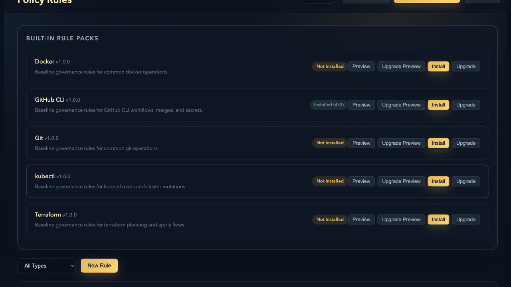
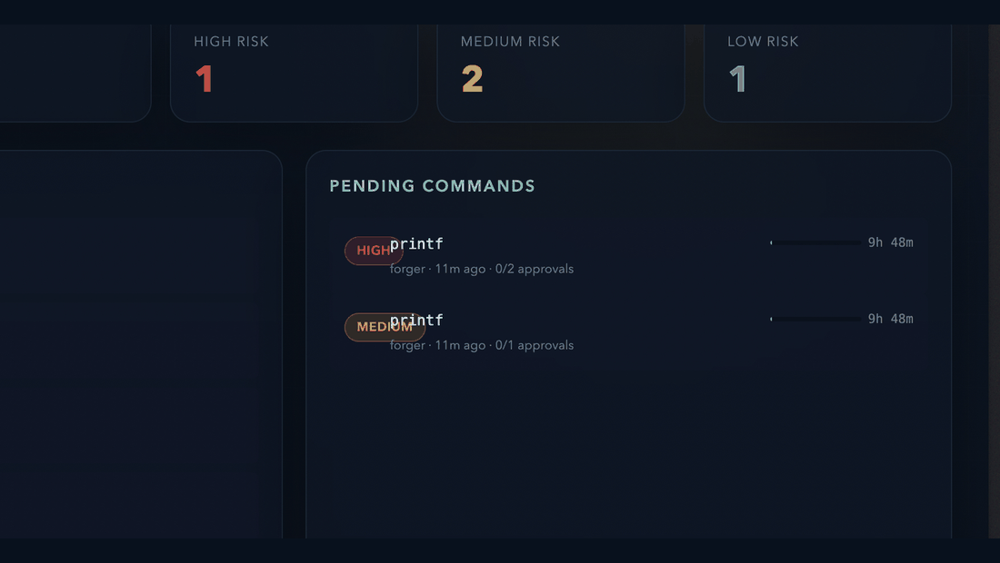

<p align="center">
  
</p>

<h1 align="center">Niyam</h1>

<p align="center">
  Approval-first command control for AI agents and operator teams.
</p>

<p align="center">
  Self-hosted. Policy-aware. Wrapper-capable. Audit-heavy.
</p>

<p align="center">
  <a href="./docs/local_setup.md">Local Setup</a> ·
  <a href="./docs/usage.md">Usage</a> ·
  <a href="./docs/api_reference.md">API</a> ·
  <a href="./docs/deployment.md">Deployment</a> ·
  <a href="./docs/features.md">Features</a>
</p>



## Why It Exists

AI agents are useful right up until they become invisible shells with too much reach.

Niyam gives teams one explicit control layer between:

- the system that wants to run a command
- the machine that would otherwise execute it blindly

So you can decide:

- how risky a command is
- whether it needs approval
- whether it runs `DIRECT` or through a wrapper
- how it gets audited, redacted, and recovered

## What You Get

- policy simulation before submission
- approvals for `LOW`, `MEDIUM`, and `HIGH`
- rule-driven `DIRECT` vs `WRAPPER`
- built-in policy templates for `gh`, `git`, `docker`, `kubectl`, and `terraform`
- redacted history and audit data with encrypted raw execution payloads
- smoke tests, backups, restore, and operator tooling

Examples:

- `ls public` can auto-run as `LOW`
- `git merge` can require approval and still stay `DIRECT`
- `gh workflow run` can require approval and resolve to `WRAPPER`

## Preview

| Rules and templates | Pending approvals |
| --- | --- |
|  |  |

## Quick Start

```bash
npm install
NIYAM_ADMIN_PASSWORD=change-me NIYAM_EXEC_DATA_KEY=local-dev-key npm start
```

Open `http://localhost:3000` and sign in with:

- username: `admin`
- password: the value of `NIYAM_ADMIN_PASSWORD`

Want guided setup instead?

```bash
./oneclick-setup.sh
```

## Start Here

- [Local setup](./docs/local_setup.md): install, env, local run, smoke flow
- [Usage guide](./docs/usage.md): approvals, packs, wrapper mode, operator flow
- [Feature guide](./docs/features.md): simulation, templates, redaction
- [API reference](./docs/api_reference.md): endpoints and payloads

## Operator Docs

- [Configuration](./docs/configuration.md)
- [Deployment](./docs/deployment.md)
- [Backup and restore](./docs/backup_restore.md)
- [Exec key rotation](./docs/key_rotation.md)
- [Load and soak testing](./docs/load_testing.md)

## Built-In Templates

Installable starting points for:

- `gh`
- `git`
- `docker`
- `kubectl`
- `terraform`

These help teams start from sane defaults instead of writing every rule from scratch.

## Upcoming Channels

Planned approval surfaces:

- Slack
- Discord
- chat-driven approve or reject flows with rationale capture

Niyam stays the system of record while approvals move closer to where teams already collaborate.

## Verify

```bash
npm test
npm run smoke
npm run smoke:wrapper
npm run smoke:dashboard
npm run smoke:dashboard:reset
```

More:

- [Security](./docs/security.md)
- [Contributing](./docs/contributing.md)
- [Public release checklist](./docs/public_release.md)
- [Test report](./docs/test_report.md)
