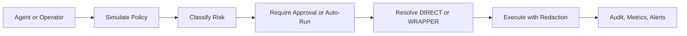

<p align="center">
  
</p>

<h1 align="center">Niyam</h1>

<p align="center">
  Approval-first command control for developer agents and operator teams.
</p>

<p align="center">
  Self-hosted. Policy-aware. Wrapper-capable. Audit-heavy.
</p>

## Why Niyam

Agents are useful right up until they become invisible shells with too much reach.

Niyam sits between:

- the system that wants to run a command
- the machine that would otherwise execute it blindly

It gives you one explicit control plane for:

- risk classification
- approval gating
- direct vs wrapper execution
- audit, redaction, and operator recovery

This is not a hosted approval SaaS. Niyam is a single-instance control layer you run in your own environment.

## What It Solves

- low-risk commands can move immediately
- risky commands can stop for approval
- sensitive commands can be forced through a wrapper or containerized path
- dangerous patterns can be blocked entirely
- every request, approval, execution, and rejection is recorded

Examples:

- `ls public` can resolve to `LOW` and auto-run
- `git merge` can require approval and still stay `DIRECT`
- `gh workflow run` can require approval and resolve to `WRAPPER`
- destructive filesystem patterns can be denied or isolated by rule

## Product Loop



## Core Capabilities

- server-truth policy simulation before submission
- rule-driven approvals for `LOW`, `MEDIUM`, and `HIGH`
- rule-driven `DIRECT` vs `WRAPPER` execution
- two-person approval support for high-risk flows
- storage-time secret redaction with encrypted raw execution payloads
- persistent admin sessions and bearer-token agent access
- structured logs, metrics, alerts, audit history, and exports
- backup, restore, exec-key rotation, load, soak, and smoke tooling

## Prebuilt Policy Templates

Niyam ships with installable policy templates for tooling teams already use:

- `gh`
- `git`
- `docker`
- `kubectl`
- `terraform`

These templates are starting points for:

- risk classification
- approval defaults
- wrapper routing for sensitive operations
- faster operator setup without hand-writing everything from zero

Install a pack, review the generated policy, then tune from a usable baseline.

## Upcoming Channels

Planned operator-facing approval channels:

- Slack approval prompts
- Discord approval prompts
- chat-driven approve or reject actions with rationale capture
- high-risk notifications for pending and wrapper-routed operations

The goal is to let teams approve from trusted collaboration surfaces while Niyam remains the system of record.

## Quick Start

```bash
npm install
NIYAM_ADMIN_PASSWORD=change-me NIYAM_EXEC_DATA_KEY=local-dev-key npm start
```

Open `http://localhost:3000` and sign in with:

- username: `admin` unless `NIYAM_ADMIN_USERNAME` is set
- password: the value of `NIYAM_ADMIN_PASSWORD`

If you want the guided bootstrap:

```bash
./oneclick-setup.sh
```

or:

```bash
npm run setup:interactive
```

The setup flow can also start an existing env and stream logs directly.

## Docs

Start here:

- [Local setup](./docs/local_setup.md)
- [Usage guide](./docs/usage.md)
- [Feature guide](./docs/features.md)

Operators:

- [Configuration reference](./docs/configuration.md)
- [Self-hosted deployment](./docs/deployment.md)
- [Backup and restore](./docs/backup_restore.md)
- [Exec key rotation](./docs/key_rotation.md)
- [Load and soak testing](./docs/load_testing.md)

Integrators and reviewers:

- [API reference](./docs/api_reference.md)
- [Security](./docs/security.md)
- [Contributing](./docs/contributing.md)
- [Public release checklist](./docs/public_release.md)
- [Test report](./docs/test_report.md)

## Verify

```bash
npm test
npm run smoke
npm run smoke:wrapper
npm run smoke:dashboard
npm run smoke:dashboard:reset
npm run load
npm run soak
```

What that covers:

- policy simulation against the real server
- pack install and rule matching
- wrapper routing
- redaction in history, output, and audit data
- dashboard demo-data populate and cleanup
- backup, restore, and exec-key rotation
- burst and sustained benchmark traffic

## Smoke Flows

- `npm run smoke`
  Core runtime verification.
- `npm run smoke:wrapper`
  Rule-driven wrapper path verification.
- `npm run smoke:dashboard`
  Safe demo data for UI review.
- `npm run smoke:dashboard:reset`
  Removes only dashboard smoke artifacts.

## Operating Thesis

Niyam is for teams that want agents to be useful without becoming unaccountable root shells.

It gives you one narrow, explicit place to enforce approval, isolation, auditability, and recovery before command execution turns into incident response.
